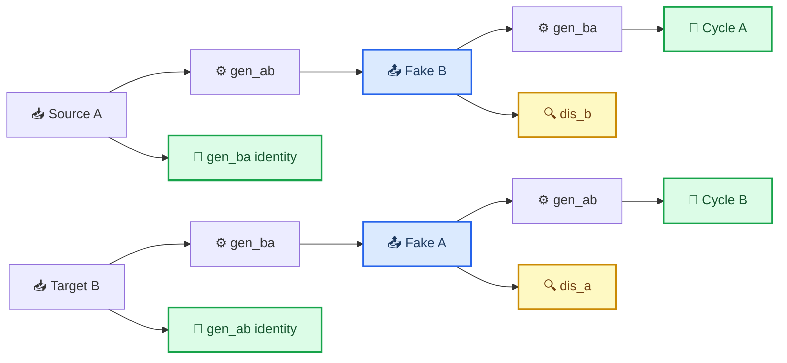
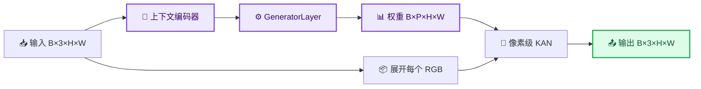
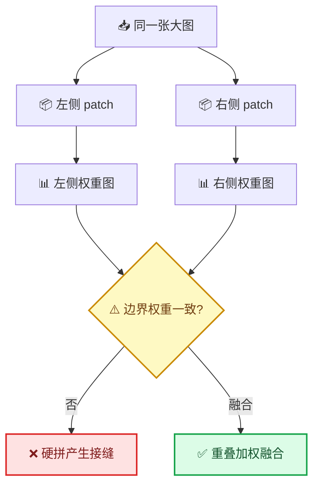

# cmKAN 自定义非配对训练与推理指南

_从数据准备、CycleCmKAN 训练到整图推理与服务器排错的一站式说明 · 最后核对：2026-07-16_

---

## 📋 概览

本指南对应仓库中的 `custom_unpaired` 训练流程，适用于 source 和 target
没有一一对应关系的图像数据。完成本文步骤后，可以：

- 使用独立的 `train/source`、`train/target` 训练
- 直接使用独立的 `val/source`、`val/target` 验证
- 理解 CycleCmKAN 的生成器、判别器及各项 loss
- 使用 checkpoint 完成 source → target 或 target → source 推理
- 从 `metrics.csv` 查看训练曲线
- 处理 Pydantic、Rich、GPU 编号和图像尺寸问题

整体流程如下：


## 🔧 环境准备

### 创建隔离环境

推荐使用 Python 3.10：

```bash
conda create -n cmkan310 python=3.10 -y
conda activate cmkan310

cd /path/to/cmKAN
python -m pip install -r requirements.txt
```

检查关键版本：

```bash
python -c "import torch, torchvision, pydantic, lightning, rich; \
print('torch:', torch.__version__); \
print('torchvision:', torchvision.__version__); \
print('pydantic:', pydantic.__version__); \
print('lightning:', lightning.__version__); \
print('rich:', rich.__version__)"
```

项目代码按 PyTorch 2.0.0、torchvision 0.15.1 和 Pydantic 2 编写。

### 服务器选择 GPU 7

推荐在启动命令上设置环境变量，不要把配置中的 `accelerator` 写成数字：

```bash
CUDA_DEVICE_ORDER=PCI_BUS_ID \
CUDA_VISIBLE_DEVICES=7 \
./scripts/train_custom_unpaired.sh /absolute/path/to/my_dataset
```

配置文件保持：

```yaml
accelerator: gpu
```

物理 GPU 7 对当前进程是唯一可见的设备，因此在 PyTorch 内部会重新编号为
`cuda:0`。可以在训练前验证：

```bash
CUDA_VISIBLE_DEVICES=7 python -c \
"import torch; print(torch.cuda.device_count()); print(torch.cuda.get_device_name(0))"
```

如果一定要在 Python 中设置，必须放在 `main.py` 第一行附近，并早于任何
`torch`、`lightning` 或 `cm_kan` 导入：

```python
import os

os.environ["CUDA_DEVICE_ORDER"] = "PCI_BUS_ID"
os.environ["CUDA_VISIBLE_DEVICES"] = "7"

import torch
```

## 📚 数据准备

### 默认目录结构

```text
my_dataset/
├── train/
│   ├── source/
│   │   ├── 001.png
│   │   └── ...
│   └── target/
│       ├── a.png
│       └── ...
└── val/
    ├── source/
    │   └── ...
    └── target/
        └── ...
```

source 和 target 是两个独立域，文件名和图片数量都不需要对应。加载器支持
PNG、JPG、JPEG、BMP、TIFF 和 WebP，并默认递归扫描子目录。

### train、val 与 test 的处理

| 数据部分 | 当前行为 |
| --- | --- |
| `train/source` | 按 DataLoader 顺序取样，DataLoader 本身会 shuffle |
| `train/target` | 每次随机选择 target 图片，与 source 无需对应 |
| `val/source`、`val/target` | 直接使用独立 val，不从 train 再划分 |
| `test/source`、`test/target` | 如果存在则直接使用 |
| 没有 `test` | 测试加载器复用 val，但不会混入训练集 |
| 没有 `val` | 按配置比例从两个训练域分别确定性划分 |

验证阶段虽然按确定顺序加载两个域，但不会把相同索引当作像素级配对真值；
验证使用 cycle 和 identity loss。

### 图像增强

训练图像依次执行：

1. 转为 torchvision ImageTensor
2. Resize 到 `resize_size`
3. 随机裁剪到 `crop_size`
4. 随机水平翻转
5. 按配置选择是否垂直翻转
6. 转为 `float32` 并归一化到 `[0, 1]`

val/test 使用 Resize 和中心裁剪，不使用随机增强。颜色抖动被刻意省略，因为
颜色变化会干扰 source/target 颜色分布的学习。

灰度图会扩展为 RGB，RGBA 会去掉 alpha；无符号 16 位图片会先归一化为
`float32`，以兼容 PyTorch 2.0。

## 🔄 非配对数据如何训练

### 模型组成

`CycleCmKAN` 包含四个主要网络：

| 网络 | 作用 |
| --- | --- |
| `gen_ab` | source A → target B |
| `gen_ba` | target B → source A |
| `dis_a` | 判断图片是否属于真实 source 域 |
| `dis_b` | 判断图片是否属于真实 target 域 |

每个训练 batch 只要求同时拿到一批 source 和一批 target，不要求它们描述相同
场景。一次生成器训练包括以下路径：



### Loss 的具体组成

循环重建 loss 同时使用 L1 与 SSIM：

```text
cycle(x̂, x) = L1(x̂, x) + 0.15 × (1 - SSIM(x̂, x))
```

生成器总 loss：

```text
L_cycle    = cycle(cycle_A, A) + cycle(cycle_B, B)
L_identity = L1(identity_A, A) + L1(identity_B, B)

L_G = adversarial_A + adversarial_B
      + 10 × (L_cycle + 0.5 × L_identity)
```

对抗项使用 MSE：生成器希望判别器把 `fake_A`、`fake_B` 判断为真。判别器分别
比较真实图与 ImagePool 中的历史伪图：

```text
L_D = 0.5 × (fake_A + real_A + fake_B + real_B)
```

每个 batch 先更新两个生成器，再更新两个判别器。Adam 使用
`betas=(0.5, 0.999)`；学习率在前 100 个 epoch 保持不变，随后线性衰减。

### val loss

由于 val 也是非配对数据，不计算逐像素的 source → target PSNR/SSIM。当前验证
指标为：

```text
val_loss = val_cycle_loss + 0.5 × val_identity_loss
```

checkpoint 监控 `val_loss`。这个指标衡量循环一致性和域内 identity 保真，不等同
于有配对真值时的色差指标。

### 空间变化的 KAN 权重

当前模型确实会根据输入图像上下文生成空间变化的 KAN 参数：



`P` 是一层 KAN 所需的参数总数。位置 `(h, w)` 使用自己的
`weights[:, :, h, w]`，而不是整张图共享一套固定 LUT。

## ⚙️ 启动与配置训练

### 最简启动命令

数据目录名为默认的 `source/target` 时：

```bash
./scripts/train_custom_unpaired.sh /absolute/path/to/my_dataset
```

脚本参数依次为：

```text
train_custom_unpaired.sh DATA_ROOT SOURCE_DOMAIN TARGET_DOMAIN CONFIG_PATH
```

默认值为：

```text
DATA_ROOT=data/custom_unpaired
SOURCE_DOMAIN=source
TARGET_DOMAIN=target
CONFIG_PATH=configs/custom_unpaired.example.yaml
```

使用自定义配置文件：

```bash
cp configs/custom_unpaired.example.yaml configs/my_custom_unpaired.yaml

./scripts/train_custom_unpaired.sh \
  /absolute/path/to/my_dataset \
  source \
  target \
  configs/my_custom_unpaired.yaml
```

等价的 Python 命令：

```bash
python main.py train \
  --config configs/custom_unpaired.example.yaml \
  --data-root /absolute/path/to/my_dataset \
  --source-domain source \
  --target-domain target
```

### 常用配置

| 配置项 | 说明 |
| --- | --- |
| `crop_size` | 实际送入模型的训练尺寸 |
| `resize_size` | 裁剪前的缩放尺寸，必须不小于 `crop_size` |
| `num_workers` | DataLoader 工作进程数，排错时可设为 `0` |
| `batch_size` | 训练 batch size |
| `val_batch_size` | 验证 batch size |
| `lr` | 生成器和判别器初始学习率 |
| `epochs` | 总训练轮数 |
| `save_freq` | checkpoint 保存间隔 |
| `visualize_freq` | 结果预览间隔 |
| `training_mode` | 自定义非配对训练应为 `adversarial` |
| `pretrained` | 从头训练时设为 `false` |

当前示例是 `crop_size: 32`、`resize_size: 36`，适用于小 patch。如果训练图片
是大图，建议从 `crop_size: 256`、`resize_size: 286` 开始；显存允许时可用
`512/544` 获取更大上下文。

## 📊 日志与断点续训

当前训练使用原生 `CSVLogger`，默认输出：

```text
experiments/custom_unpaired/
└── logs/
    ├── checkpoints/
    │   └── last.ckpt
    └── metrics.csv
```

`metrics.csv` 中可看到：

- `step`、`epoch`
- `gen_loss`
- `dis_loss`
- `val_cycle_loss`
- `val_identity_loss`
- `val_loss`
- 学习率

CSV 的不同行可能只包含当时更新的部分指标，读取时应允许空值。可以使用
Pandas、Excel 或其他绘图工具绘制 loss 曲线。

断点续训时，将配置改为：

```yaml
resume: true
```

然后执行相同训练命令。程序会尝试读取：

```text
experiments/<experiment>/logs/checkpoints/last.ckpt
```

## ✅ 训练后一键测试

仓库提供 `scripts/test_custom_unpaired.sh`，一次完成：

1. 在 `test` 上计算 Cycle/Identity loss；没有 `test` 时自动复用 `val`
2. 对 source 图片执行 source → target 整图推理
3. 对 target 图片执行 target → source 整图推理

对于标准的 `source`、`target` 目录，直接执行：

```bash
CUDA_VISIBLE_DEVICES=7 ./scripts/test_custom_unpaired.sh
```

服务器默认数据目录已经设置为 `/home/share/y50063074/data`，默认结果目录是
`results/custom_unpaired`，因此不需要输入路径参数。

脚本参数顺序如下：

```text
test_custom_unpaired.sh \
  DATA_ROOT \
  SOURCE_DOMAIN \
  TARGET_DOMAIN \
  CONFIG_PATH \
  WEIGHTS \
  OUTPUT_ROOT
```

完整示例：

```bash
CUDA_VISIBLE_DEVICES=7 ./scripts/test_custom_unpaired.sh \
  /absolute/path/to/my_dataset \
  source \
  target \
  configs/custom_unpaired.example.yaml \
  logs/checkpoints/last.ckpt \
  results/my_experiment
```

其中 `WEIGHTS` 相对于配置中的
`<save_dir>/<experiment>/`，不要传 `--reverse 1`。脚本已经正确地使用了无参数的
`--reverse` 开关。

结果位置：

```text
experiments/<experiment>/test_logs/
├── metrics.csv                 # test_cycle_loss、test_identity_loss、test_loss
└── figures/test_*.png          # source、非配对 target、生成结果预览

results/my_experiment/
├── source_to_target/           # 正向整图结果
└── target_to_source/           # 反向整图结果
```

测试和推理使用独立的 `test_logs`、`predict_logs`，不会覆盖
`experiments/<experiment>/logs/metrics.csv` 中的训练记录。如果 checkpoint 不存在，
程序会直接报错退出，不再悄悄使用未训练权重。

### 不上传图片的亮度与色偏诊断

数据不能离开服务器时，可以只统计聚合数值：

```bash
python scripts/diagnose_prediction_stats.py
```

诊断脚本使用与测试脚本相同的默认数据和结果目录。

如需临时更换默认值，可使用环境变量而不修改脚本：

```bash
CMKAN_DATA_ROOT=/new/data/path \
CMKAN_RESULTS_ROOT=/new/results/path \
python scripts/diagnose_prediction_stats.py
```

脚本递归抽样 source、target 和两个推理结果目录，只输出：

- 亮度均值、标准差和 1%/50%/99% 分位数
- 黑色与白色像素比例
- RGB 三通道均值
- 输出域相对目标域的亮度差、对比度比例和颜色偏移

它不会输出图片、文件名或单张图片统计。若输出中出现
`output is substantially darker`、`contrast is compressed` 或
`strong channel/color distribution shift`，即可分别定位整体变暗、灰雾化或肤色色偏。

## 🚀 整图推理

### 当前推理流程

当前 `predict` 不进行 patch 切分，也不读取训练数据集的 target 图片：

1. 扫描输入目录当前层的 `.png`、`.jpg`
2. 转为 `float32` 并归一化到 `[0, 1]`
3. 从 checkpoint 恢复模型
4. 默认调用 `gen_ab` 完成 source → target
5. 添加 `--reverse` 时调用 `gen_ba` 完成 target → source
6. 按原文件名写入输出目录

判别器仅用于训练，推理时不会参与计算。

### source → target

```bash
CUDA_VISIBLE_DEVICES=7 python main.py predict \
  --config configs/custom_unpaired.example.yaml \
  --weights logs/checkpoints/last.ckpt \
  --input /absolute/path/to/source_images \
  --output /absolute/path/to/results \
  --batch_size 1
```

`--weights` 是相对于 `experiments/<experiment>/` 的路径。

### target → source

```bash
CUDA_VISIBLE_DEVICES=7 python main.py predict \
  --config configs/custom_unpaired.example.yaml \
  --weights logs/checkpoints/last.ckpt \
  --input /absolute/path/to/target_images \
  --output /absolute/path/to/reverse_results \
  --batch_size 1 \
  --reverse
```

不同尺寸图片应使用 `batch_size=1`。模型内部有两级 DWT 下采样，当前推理代码
没有自动 padding，因此输入高宽最好都是 4 的倍数。

## ⚠️ Patch、块效应与限制

训练时随机裁 patch 不等于推理时分块拼接：

- 训练用 patch、推理用整图：没有人工拼接边界，通常不会产生硬接缝
- 推理切 patch 后直接拼接：每块分别生成上下文权重，可能出现色调或亮度接缝



显存允许时优先整图推理，使用 `batch_size=1`。如果必须分块，建议以
`patch_size=512`、`overlap=128` 为起点，使用 Hann 或余弦权重融合重叠区域。
当前仓库尚未实现自动 overlap-tile 推理。

## 🔍 常见问题

### cannot import name model_validator from pydantic

原因是当前环境安装了 Pydantic 1.x，而项目使用 Pydantic 2 API。

```bash
python -m pip uninstall -y pydantic
python -m pip install "pydantic==2.11.7"

python -c "import pydantic; print(pydantic.__version__); from pydantic import model_validator"
```

### IndexError: pop from empty list

如果 traceback 指向 Rich 进度条，检查版本：

```bash
python -c "import rich, lightning; print(rich.__version__, lightning.__version__)"
```

Lightning 2.1.2 与 Rich 15.0.0 不兼容。Lightning 2.1.2 的包元数据要求
`rich>=12.3,<14.0`；Rich 14.1+ 的 `clear_live()` 空栈行为会触发同样的
`IndexError`。[^1]

推荐固定：

```bash
python -m pip install --force-reinstall "rich==13.9.4"
python -m pip check
```

Lightning 后续版本已经合并了对应的进度条清理修复，但直接升级 Lightning 可能
同时改变 PyTorch 兼容范围，因此当前工程优先采用降级 Rich 的低风险方案。[^2]

### 指定 GPU 7 后仍然使用其他卡

确认环境变量设置早于 Python 导入，并且不要同时调用
`torch.cuda.set_device(7)`：

```bash
CUDA_VISIBLE_DEVICES=7 python -c \
"import torch; print(torch.cuda.device_count()); print(torch.cuda.current_device())"
```

预期输出为 `1` 和 `0`：物理卡 7 在当前进程内映射成逻辑卡 0。

### 图像尺寸报错或特征无法拼接

当前 cmKAN 有两级 stride-2 DWT，整图推理时高宽应为 4 的倍数。训练阶段的
`crop_size` 也建议使用 4 的倍数。

### CUDA out of memory

按顺序尝试：

1. 将推理 `batch_size` 设为 `1`
2. 减小训练 `batch_size`
3. 减小 `crop_size`
4. 必须处理超大图时实现重叠分块推理

### 找不到图片或目录

训练检查 `train/source`、`train/target`、`val/source`、`val/target`。项目外的
数据建议使用绝对路径。推理当前只扫描输入目录当前层的 `.png` 与 `.jpg`，不会
递归扫描。

## 🔗 参考资料

- [训练入口](../cm_kan/cli/train.py)
- [非配对 DataModule](../cm_kan/ml/datasets/custom_unpaired/img_datamodule.py)
- [非配对 Dataset](../cm_kan/ml/datasets/custom_unpaired/img_dataset.py)
- [CycleCmKAN 模型](../cm_kan/ml/models/cycle_cm_kan.py)
- [非监督训练 Pipeline](../cm_kan/ml/pipelines/unsupervised.py)
- [推理入口](../cm_kan/cli/predict.py)

[^1]: Textualize. (2025). "IndexError: pop from empty list with Rich progress bar." _Rich issue #3809_. https://github.com/Textualize/rich/issues/3809

[^2]: Lightning AI. (2025). "Progress bar console clearing for latest Rich release." _PyTorch Lightning PR #21016_. https://github.com/Lightning-AI/pytorch-lightning/pull/21016
