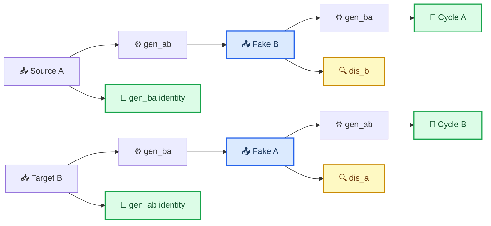
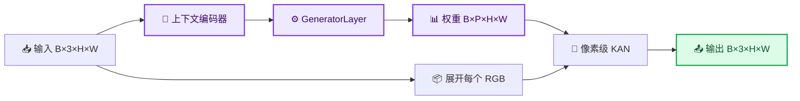
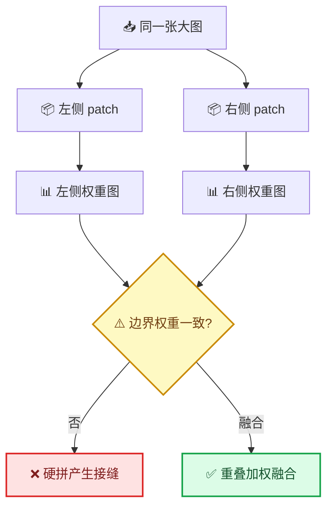

# cmKAN 自定义非配对训练与推理指南

_从数据准备、CycleCmKAN 训练到参考图引导推理与服务器排错的一站式说明 · 最后核对：2026-07-23_

---

## 📋 概览

本指南对应仓库中的 `custom_unpaired` 训练流程，适用于 source 和 target
没有一一对应关系的图像数据。完成本文步骤后，可以：

- 使用独立的 `train/source`、`train/target` 训练
- 直接使用独立的 `val/source`、`val/target` 验证
- 理解 CycleCmKAN 的生成器、判别器及各项 loss
- 使用一张 target 参考图控制同一张 source 的颜色、色温与明暗风格
- 使用 checkpoint 完成 source → target 或 target → source 推理
- 从 `metrics.csv` 查看训练曲线
- 处理 Pydantic、Rich、GPU 编号和图像尺寸问题

整体流程如下：


## 🔧 环境准备

### 创建隔离环境

推荐使用 Python 3.10：

```bash
conda create -n cmkan310 python=3.10 -y
conda activate cmkan310

cd /path/to/cmKAN
python -m pip install -r requirements.txt
```

检查关键版本：

```bash
python -c "import torch, torchvision, pydantic, lightning, rich; \
print('torch:', torch.__version__); \
print('torchvision:', torchvision.__version__); \
print('pydantic:', pydantic.__version__); \
print('lightning:', lightning.__version__); \
print('rich:', rich.__version__)"
```

项目代码按 PyTorch 2.0.0、torchvision 0.15.1 和 Pydantic 2 编写。

### 服务器选择 GPU 7

推荐在启动命令上设置环境变量，不要把配置中的 `accelerator` 写成数字：

```bash
CUDA_DEVICE_ORDER=PCI_BUS_ID \
CUDA_VISIBLE_DEVICES=7 \
./scripts/train_custom_unpaired.sh /absolute/path/to/my_dataset
```

配置文件保持：

```yaml
accelerator: gpu
```

物理 GPU 7 对当前进程是唯一可见的设备，因此在 PyTorch 内部会重新编号为
`cuda:0`。可以在训练前验证：

```bash
CUDA_VISIBLE_DEVICES=7 python -c \
"import torch; print(torch.cuda.device_count()); print(torch.cuda.get_device_name(0))"
```

如果一定要在 Python 中设置，必须放在 `main.py` 第一行附近，并早于任何
`torch`、`lightning` 或 `cm_kan` 导入：

```python
import os

os.environ["CUDA_DEVICE_ORDER"] = "PCI_BUS_ID"
os.environ["CUDA_VISIBLE_DEVICES"] = "7"

import torch
```

## 📚 数据准备

### 默认目录结构

```text
my_dataset/
├── train/
│   ├── source/
│   │   ├── 001.png
│   │   └── ...
│   └── target/
│       ├── a.png
│       └── ...
└── val/
    ├── source/
    │   └── ...
    └── target/
        └── ...
```

在默认的 `pairing_mode: random` 下，source 和 target 是两个独立域，文件名和图片
数量都不需要对应。加载器支持 PNG、JPG、JPEG、BMP、TIFF 和 WebP，并默认递归
扫描子目录。本项目当前推荐的一对一参考训练则使用后面说明的 `one_to_one`。

如果两域只能做到主题或场景类别相似，可以在 source 和 target 下建立相同的
相对子目录，并设置 `pair_by_subdirectory: true`：

```text
my_dataset/train/
├── source/
│   ├── indoor/...
│   ├── outdoor/...
│   └── portrait/...
└── target/
    ├── indoor/...
    ├── outdoor/...
    └── portrait/...
```

三种 `pairing_mode` 的含义如下：

- `random`：同名子目录之间仍然随机非配对采样。
- `weak_aligned`：建立固定弱配对；数量不同时允许相邻 source 共享 target。
- `one_to_one`：严格保证“一个 source 对应一个 target”，不重复也不遗漏任何 target。

后两种模式都会优先按完整且唯一的相对文件名匹配（忽略扩展名）。如果文件名集合无法
完整匹配，就在同名相对子目录中分别按自然数字顺序排序再一一对应，例如 `2.jpg` 会排在
`10.jpg` 前面。`one_to_one` 要求 train、val（以及显式 test）中的两域总数相同、相对
子目录集合相同、每个对应子目录的图片数也相同；任一条件不满足都会在训练开始时直接
报错，绝不会偷偷复用 target。最好让真正对应的图片使用相同相对文件名；否则必须保证
两边自然排序后的顺序就是实际对应顺序。三种模式都不代表人物姿态或像素位置严格对齐，
平铺目录会自动归入同一个全局组。

### train、val 与 test 的处理

| 数据部分 | 当前行为 |
| --- | --- |
| `train/source` | 按 DataLoader 顺序取样，DataLoader 本身会 shuffle |
| `train/target` | `random` 时随机选择；`weak_aligned` 时固定弱配对；`one_to_one` 时唯一固定配对 |
| `val/source`、`val/target` | 直接使用独立 val，不从 train 再划分 |
| `test/source`、`test/target` | 如果存在则直接使用 |
| 没有 `test` | 测试加载器复用 val，但不会混入训练集 |
| 没有 `val` | 仅 `random` 可按比例分别划分；两个对齐模式要求显式 val，避免拆散配对 |

验证阶段始终使用确定映射。即使选择 `one_to_one`，target 也只是内容近似的颜色参考，
不会被当作 source 的像素级真值；验证仍使用 cycle、identity 和参考统计 loss。

### 图像增强

训练图像依次执行：

1. 转为 torchvision ImageTensor
2. Resize 到 `resize_size`
3. 随机裁剪到 `crop_size`
4. 随机水平翻转
5. 按配置选择是否垂直翻转
6. 转为 `float32` 并归一化到 `[0, 1]`

`weak_aligned` 和 `one_to_one` 会让 source 与 target 使用同一归一化裁剪位置和相同
翻转决定；即使两张图的原始长宽比不同，也会裁取各自画面中的相近区域。完全非配对
模式仍独立增强两域。
val/test 使用 Resize 和中心裁剪，不使用随机增强。颜色抖动被刻意省略，因为
颜色变化会干扰 source/target 颜色分布的学习。

灰度图会扩展为 RGB，RGBA 会去掉 alpha；无符号 16 位图片会先归一化为
`float32`，以兼容 PyTorch 2.0。

## 🔄 非配对数据如何训练

### 模型组成

`CycleCmKAN` 包含四个主要网络：

| 网络 | 作用 |
| --- | --- |
| `gen_ab` | source A → target B |
| `gen_ba` | target B → source A |
| `dis_a` | 判断图片是否属于真实 source 域 |
| `dis_b` | 判断图片是否属于真实 target 域 |

每个训练 batch 只要求同时拿到一批 source 和一批 target，不要求它们描述相同
场景。一次生成器训练包括以下路径：



### Loss 的具体组成

循环重建 loss 同时使用 L1 与 SSIM：

```text
cycle(x̂, x) = L1(x̂, x) + 0.15 × (1 - SSIM(x̂, x))
```

普通 `cycle_cm_kan` 配置的生成器总 loss：

```text
L_cycle    = cycle(cycle_A, A) + cycle(cycle_B, B)
L_identity = L1(identity_A, A) + L1(identity_B, B)
L_stats    = RGB mean/std(fake_A, A) + RGB mean/std(fake_B, B)
L_exposure = luminance mean/std(fake_A, B) + luminance mean/std(fake_B, A)
L_chroma   = chromaticity(fake_A, B) + chromaticity(fake_B, A)
L_reflect  = Retinex reflectance(fake_A, B) + Retinex reflectance(fake_B, A)
L_patchNCE = patch contrast(fake_A, B) + patch contrast(fake_B, A)
L_range    = values below 0 or above 1

L_G = 1 × L_adversarial
      + 10 × L_cycle
      + 5 × L_identity
      + 1 × L_stats
      + 2 × L_exposure
      + 2 × L_chroma
      + 1 × L_reflect
      + 1 × L_patchNCE
      + 1 × L_range
```

`L_exposure` 使用同一张输入图约束转换前后的亮度均值和对比度，专门防止
target → source 出现整体乘以约 0.42 的压暗退化；`L_stats` 使用目标域 batch 的
RGB 均值和标准差约束域颜色；`L_chroma` 比较同一人物转换前后的归一化 RGB
色度，允许整体亮度变化但抑制肤色偏色；`L_reflect` 在 log luminance 中移除
低频平滑光照后比较局部反射细节，避免模型把非配对 target 人物较暗的固有
肤色误学成域风格。`L_patchNCE` 使用 cmKAN 生成空间 KAN 权重时已有的上下文
特征，对比同一输入及其生成图的相同空间 patch；其他位置作为负样本。因此它
约束人物和场景内容，但不会在不对齐的 source/target 之间计算像素 L1/SSIM。
`L_range` 防止生成器依赖保存时的截断。

对抗项使用 MSE：生成器希望判别器把 `fake_A`、`fake_B` 判断为真。判别器分别
比较真实图与 ImagePool 中的历史伪图：

```text
L_D = 0.5 × (fake_A + real_A + fake_B + real_B)
```

每个 batch 先更新两个生成器，再更新两个判别器。Adam 使用
`betas=(0.5, 0.999)`；学习率在前 100 个 epoch 保持不变，随后线性衰减。

### val loss

由于 val 也是非配对数据，不计算逐像素的 source → target PSNR/SSIM。当前验证
指标为：

```text
val_loss = 1 × val_adversarial_loss
           + 10 × val_cycle_loss
           + 5 × val_identity_loss
           + 1 × val_statistics_loss
           + 2 × val_exposure_loss
           + 2 × val_chroma_loss
           + 1 × val_reflectance_loss
           + 1 × val_patch_nce_loss
           + 1 × val_range_loss
```

普通非配对模型的 checkpoint 监控 `val_loss`。这个指标衡量循环一致性和域内
identity 保真，不等同于有配对真值时的色差指标。v3 参考图稳定版改为监控固定权重的
`val_reference_selection_loss`；它不包含会随判别器强弱变化的对抗分数，因此更适合
比较 warm-up、对抗渐增和完整训练三个阶段的 checkpoint。

参考图模式会在上述框架中加入逐样本 `L_ref_style`，并使用参考专用配置中的
权重组合；不要把这里列出的普通模式默认权重直接套到参考图实验。

### 空间变化的 KAN 权重

当前模型确实会根据输入图像上下文生成空间变化的 KAN 参数：



`P` 是一层 KAN 所需的参数总数。位置 `(h, w)` 使用自己的
`weights[:, :, h, w]`，而不是整张图共享一套固定 LUT。

## 🎨 参考图引导模式（当前数据推荐）

### 为什么需要参考图

普通 `CycleCmKAN` 只学习“整个 target 域大致长什么样”。当 target 中同时存在
偏黄、偏蓝、明亮和偏暗等多种风格时，判别器很容易让生成器收敛到一个折中
结果；它不能知道本次输出究竟应该模仿哪一种色温。

`ReferenceCycleCmKAN` 把每次传入的 target 图片作为**本次转换的风格参考**：

```mermaid
flowchart LR
    accTitle: 参考图引导的 source 到 target 转换
    accDescr: source 提供待转换内容和空间上下文，target 参考图提供全局颜色统计；两者的统计差经过条件调制后影响空间 KAN 权重，并由参考风格损失监督输出靠近本次参考

    source[📷 Source 内容图] --> source_context[🧠 空间上下文编码]
    source --> source_style[📊 Source 风格统计 E]
    reference[🖼️ Target 参考图] --> reference_style[📊 Reference 风格统计 E]
    source_style --> delta[➖ 风格差 Δ=E(ref)-E(source)]
    reference_style --> delta
    delta --> film[🎛️ FiLM 条件调制]
    source_context --> weight_map[⚙️ 空间 KAN 权重图]
    film --> weight_map
    source --> pixel_kan[🔄 逐像素 KAN]
    weight_map --> pixel_kan
    pixel_kan --> output[✅ 迁移结果 Fake B]
    output --> style_loss[📏 Reference style loss]
    reference_style --> style_loss

    classDef input fill:#dbeafe,stroke:#2563eb,stroke-width:2px,color:#1e3a5f
    classDef condition fill:#fef3c7,stroke:#d97706,stroke-width:2px,color:#78350f
    classDef output fill:#dcfce7,stroke:#16a34a,stroke-width:2px,color:#14532d

    class source,reference input
    class source_style,reference_style,delta,film condition
    class output output
```

风格编码器 `E` 对每张图片分别提取 10 个可微统计量：线性 RGB 的三通道
均值与标准差、CIE XYZ 转换后的整体 `x/y` 色度质心，以及亮度均值与标准差。生成器
接收的是 `E(reference) - E(source)`，而不是参考图的空间特征。因此参考图只
控制全局色彩、色温、明暗和对比度，不会把参考人物、纹理或构图复制到 source。
source 自身的上下文编码仍负责生成逐位置变化的 KAN 权重。

### 一对一弱配对参考监督（不是像素级监督）

参考图模式继续使用原来的目录：

```text
my_dataset/
├── train/
│   ├── source/...
│   └── target/...
└── val/
    ├── source/...
    └── target/...
```

不需要新增 `reference/` 目录。当前参考配置使用 `pairing_mode: one_to_one`：每个
source 只会得到自己唯一的大致对应 target，target 是该次 `source → target` 的正向
颜色参考；对应地，source 是 `target → source` 的反向参考。`val/target` 也是验证和
四图预览中真正使用的参考。这里的“一对一”约束的是样本关系，不表示空间像素对齐。

这里没有计算 `L1(fake_B, target)` 或 `SSIM(fake_B, target)`，因为大致配对图片仍可能
存在人物动作、构图和空间位置差异。target 只监督全局颜色、曝光和白平衡；Cycle、
identity、PatchNCE 与 reflectance 负责保护 source 的人物、场景和细节。因此这是
“弱配对参考统计监督”，不是严格配对的逐像素监督。

### Reference style loss

只把参考统计输入网络还不够，模型可能学会忽略它，因此增加逐样本参考风格损失：

```text
L_ref_style = L1(E(fake_B), stop_gradient(E(target_reference)))
            + L1(E(fake_A), stop_gradient(E(source_reference)))
```

它明确要求每一张输出的颜色统计靠近**本次**参考图，而不是只靠近整个 target
batch 的平均分布。训练 CSV 中可检查 `gen_reference_style_a_loss`、
`gen_reference_style_b_loss` 和 `val_reference_style_loss`。

### Reference white-balance loss

原来的 10 维风格距离会混合亮度、对比度和颜色，无法明确惩罚系统性偏暖。新版
在线性 RGB 中逐像素计算 `u=log(R/G)`、`v=log(B/G)`，忽略接近纯黑/过曝的像素。
v2 会先软性提高低饱和、接近中性的像素权重，再做一次 detached 鲁棒重加权，避免
大面积肤色、彩色墙面或高饱和物体被错误当成整张图的白平衡。然后定义：

```text
warm = 0.5 × (u - v) = 0.5 × log(R/B)
tint = 0.5 × (u + v) = 0.5 × log(RB/G²)

L_wb = ρ(warm_fake - warm_reference)
       + 0.5 × ρ(tint_fake - tint_reference)
```

`ρ` 是平滑 Charbonnier loss。source → target 和 target → source 两个方向相加。
像素选择权重和参考统计都会停止梯度，防止生成器通过操纵 mask 逃避约束。这个 loss
只匹配整图冷暖与绿—洋红偏色，不复制参考图中的脸、墙面或纹理，也不要求空间对齐。

参考配置继续将 `exposure_weight` 与旧的 `chroma_weight` 设为 `0`，避免抵消参考图
要求的全局明暗或白平衡变化。v2 新增 `reference_local_chroma_weight: 0.25`：它先从
fake 与原输入之间的逐像素 log-chroma 变化中减去整张图的平均通道增益，只惩罚剩余的
局部不一致颜色漂移。因此它允许参考图要求的全局冷暖变化，同时轻量保护肤色、衣服和
背景之间的相对颜色关系。v2 还把白平衡权重从 `3.0` 降到 `1.0`，因为第 199 轮统计
显示亮度已经对齐、冷暖平均偏差接近零，继续使用过强的整图白平衡约束反而容易过校色。
`reference_style_weight: 5.0` 保持不变，PatchNCE 与 reflectance loss 继续保护结构细节。

### v3：局部红斑与红通道过冲保护

v2 的 `reference_local_chroma_weight` 是整图平均值。脸部只占少量像素时，即使局部已经
严重变红，平均 loss 仍可能很小；旧生成器的逐像素输出也没有硬边界，保存图片时才截断，
可能把少量越界像素直接截成高饱和红色。v3 针对这两个问题增加四层保护：

- `output_mode: bounded_logit_residual`：在输入图像的 logit 空间学习有限幅度残差，
  `max_logit_shift: 1.0` 限制单次颜色变化，并保证生成结果始终处于有效像素范围。
- `reference_local_chroma_tail_weight`：额外约束局部颜色变化最严重的一小部分像素，
  防止脸部红斑被大面积正常背景稀释。
- `reference_local_red_tail_weight` 与 `reference_red_overshoot_weight`：分别约束局部
  `log(R/G)` 正向异常，以及生成图比对应 target 更红的整图过冲；target 本身合理的
  暖色不会被强行去掉。
- `range_tail_weight`：保留最坏区域的范围诊断；与有界输出共同防止极少量异常像素
  被整图均值掩盖。

v3 同时把 `reference_style_weight` 降到 `3.0`、`identity_weight` 提到 `2.0`。
有界残差输出头会在通用权重初始化之后再次清零，因此模型从恒等映射开始。稳定版使用
`warmup_epochs: 5`：epoch 0～4 训练完整的生成器非对抗目标，包括参考风格、白平衡、
局部颜色保护、曝光、cycle、identity、reflectance 和 PatchNCE，而不是旧式
identity-only warm-up；这五轮不训练判别器。epoch 5 才启动判别器，并用
`adversarial_ramp_epochs: 10` 将有效对抗权重从 epoch 5 的 `0.1` 逐步增加到
epoch 14 的 `1.0`，避免从恒等初始化直接受到满强度 GAN 梯度而首轮塌陷。

### 必须从头训练新 checkpoint

参考图模式在两个生成器中新增了条件调制层，模型类型也从 `cycle_cm_kan` 变为
`reference_cycle_cm_kan`。旧 checkpoint 没有这些参数，不能直接用于参考图推理，
也不建议从旧模型 `resume`。使用新实验名并确认配置中：

```yaml
model:
  type: reference_cycle_cm_kan
resume: false
```

启动训练：

```bash
CUDA_DEVICE_ORDER=PCI_BUS_ID \
CUDA_VISIBLE_DEVICES=7 \
./scripts/train_custom_unpaired_reference_v3.sh
```

脚本默认数据根目录是 `/home/share/y50063074/data`。若服务器目录不同，再把实际
数据根目录作为第一个参数传入。

等价命令：

```bash
CUDA_VISIBLE_DEVICES=7 python main.py train \
  --config configs/custom_unpaired_reference_v3.server.yaml \
  --data-root /absolute/path/to/my_dataset \
  --source-domain source \
  --target-domain target
```

### v3 首轮塌陷稳定版：独立实验从第 0 轮训练

当前服务器配置使用独立实验名：

```yaml
experiment: custom_one_to_one_reference_color_v3_stable
resume: false

model:
  params:
    max_logit_shift: 1.0

pipeline:
  params:
    lr: 0.0001
    epochs: 200
    adversarial_ramp_epochs: 10
    exposure_weight: 2.0
    warmup_epochs: 5
    discriminator_lr_scale: 0.5
```

因此它不会覆盖原来的 v1、v2、`custom_unpaired_reference_v6`、既有 checkpoint 或旧
`metrics.csv`。v3 必须从第 0 轮训练，不要续接第 171 轮的 v2 checkpoint，也不能
续训已经在首轮生成黑图的 v3 checkpoint；保持 `resume: false`。服务器配置默认
`batch_size: 8`、`epochs: 200`，每轮保存 `last.ckpt` 与当前最佳 checkpoint。之前的
50 轮只是为了先排除局部变色的安全试跑，并不是正式训练所需的完整周期。

启动时先检查这两个基准文件：

- `experiments/custom_one_to_one_reference_color_v3_stable/logs/figures/initial_source_to_target_0.png`：
  训练开始、任何优化器更新之前保存的零更新基线。由于输出头从恒等映射开始，它必须
  与 source 接近；若这里已经是黑图，应先检查配置和初始化，不能继续训练。
- 同目录的 `source_to_target_0.png`：完成 epoch 0 的第一轮非对抗生成器稳定训练后
  保存，不是“训练前”图片。若零更新基线正常、这里却变黑，说明首轮仍然发生了优化
  塌陷。

继续检查 epoch 5、10、14、20 的固定六组预览和报告数值：epoch 5 的有效对抗权重为
`0.1`，epoch 10 为 `0.6`，epoch 14 达到 `1.0`。只要人物结构、曝光或局部颜色明显
异常就停止，不需要等待到第 200 轮。最佳参考图 checkpoint 监控
`val_reference_selection_loss`，而不是随判别器共同变化的 `val_loss`。

旧的 `configs/custom_unpaired_reference.server.yaml` 和
`scripts/train_custom_unpaired_reference.sh` 仍完整保留，对应 v2，仅用于复现和回退。

### v4：解除参考条件的恒等锁死

v3 训练到 epoch 20 时，实测：

```text
ratio=0.9972
luma_ratio=1.03
```

`luma_ratio=1.03` 表示生成图平均亮度只比 target 高约 3%，因此不是黑图或曝光
塌陷；`ratio=0.9972` 则表示生成图到参考图的风格距离只缩短约 0.28%，实际仍与
source 几乎相同。根因是原参考条件均值很小，且它需要先穿过零初始化的间接调制层，
再穿过 KAN 的分阶段乘法结构，首步有效梯度过弱，cycle、identity 和颜色保护项很快
把模型锁在恒等映射附近。

v4 使用：

```text
condition = tanh(10 × (E(reference) - E(source)))
```

`tanh` 把条件平滑限制在 `(-1, 1)`，比硬裁剪更能保留大差异样本的梯度。新增的
`style_direct` 把这个条件直接变成一组 KAN 参数偏移，并广播加到每个空间位置的
参数图；原有上下文分支仍负责产生空间变化，因此不是把 target 的像素、人物或场景
复制到 source。direct 权重和原 affine 输出头都从零开始，所以训练前输出仍是
source，但 univariate/residual 参数行从第一步就能获得条件梯度。

v4 使用独立实验和配置：

```yaml
experiment: custom_one_to_one_reference_color_v4_conditioned
resume: false

model:
  params:
    reference_condition_scale: 10.0
    reference_direct_conditioning: true
```

启动命令：

```bash
CUDA_DEVICE_ORDER=PCI_BUS_ID \
CUDA_VISIBLE_DEVICES=7 \
./scripts/train_custom_unpaired_reference_v4.sh
```

v4 必须从第 0 轮训练。默认 `reference_direct_conditioning: false` 的旧结构仍能严格
加载 v3 checkpoint，但 v3 checkpoint 不能切换成 `true` 后续训 v4：两者参数集合和
优化器状态不同。v2/v3 的 YAML 与启动脚本保留不动，随时可以回退。

首轮零更新图仍应接近 source。epoch 1～5 重点运行
`python scripts/report_reference_metrics.py`：

- `direct` 和 `response` 应从 `0` 开始并逐渐大于 `0`；
- `ratio` 应出现下降趋势，epoch 5 仍接近 `0.99～1.00` 时就停止，不必等 200 轮；
- `luma_ratio` 应继续接近 `1`，`red_bad` 应继续接近 `0`。

如果 direct 指标和 response 已增长但 ratio 仍不下降，说明参考分支已经有梯度，下一步
应调整保护 loss 的相对权重，而不是继续放大 condition。

服务器不能直接拉取仓库时，最省事的做法是覆盖整个 `cm_kan/` 文件夹，再额外复制：

```text
configs/custom_unpaired_reference_v4.server.yaml
scripts/train_custom_unpaired_reference_v4.sh
scripts/report_reference_metrics.py
```

若只能逐文件传输，v4 实际修改的运行文件是：

```text
cm_kan/core/config/model.py
cm_kan/core/selector/model.py
cm_kan/ml/layers/cm_kan/cm_kan.py
cm_kan/ml/layers/cm_kan/generator.py
cm_kan/ml/models/cm_kan.py
cm_kan/ml/models/cycle_cm_kan.py
cm_kan/ml/pipelines/unsupervised.py
```

### v5：肤色定向迁移与局部红斑保护

style 权重改到 `15` 后虽然 `ratio` 降到约 `0.40`，但人脸更红，说明整图风格距离
可以通过整体偏色快速下降，却没有回答“脸是否接近对应 target”。现有整图
`red_bad` 还会先扣除全局颜色变化，因此整张脸均匀偏红时可能仍接近 `0`。

v5 不下载人脸模型，也不比较五官像素。它在真实 source 和真实 target 上分别用
YCbCr、亮度、饱和度生成软候选肤色区域，然后：

```text
fake target 的统计区域 = source 的候选肤色 mask
目标统计区域            = target 的候选肤色 mask
```

两个 mask、真实图统计和有效性判断都不参与反向传播；fake 不能用自己的颜色重新生成
mask，因此不能把脸改成蓝色来逃避 loss。比较的是每张图候选肤色区域的 linear-RGB
`log(R/G)`、`log(B/G)` 均值/标准差和一个小权重亮度项，不比较空间对应像素，所以
source 与 target 只需一一对应、主题和人物接近，不要求严格像素对齐，也不会复制
target 的五官或纹理。

另外有两层保护：

- 允许整块肤色相对背景发生统一迁色，但惩罚脸内不一致的颜色变化和局部红斑；
- 若 fake 肤色的 `log(R/G)` 比对应 target 还高出 margin，则单边惩罚红色过冲。

v5 使用独立实验，保留所有旧模型：

```text
configs/custom_unpaired_reference_v5_skin.server.yaml
scripts/train_custom_unpaired_reference_v5_skin.sh
experiments/custom_one_to_one_reference_color_v5_skin/
```

关键配置为：

```yaml
resume: false
pipeline:
  params:
    batch_size: 8
    reference_style_weight: 3.0
    reference_skin_tone_weight: 2.0
    reference_skin_tone_ramp_epochs: 10
    reference_skin_std_weight: 0.25
    reference_skin_luminance_weight: 0.15
    reference_skin_uniformity_weight: 0.25
    reference_skin_red_overshoot_weight: 0.5
    reference_skin_local_red_weight: 0.5
    reference_skin_red_overshoot_margin: 0.03
    reference_skin_min_fraction: 0.005
    reference_skin_max_fraction: 0.5
```

先在服务器本地生成六组 mask 预览：

```bash
python scripts/preview_skin_masks.py
```

结果只保存在服务器：

```text
experiments/custom_one_to_one_reference_color_v5_skin/logs/figures/skin_mask_preview.png
```

每行依次是 `source | source mask | target | target mask`。白色应主要覆盖脸、手等肤色
区域；每个 mask 左上角会显示覆盖率和 `ok/skip`。若大面积木墙、黄墙或衣服变白，
就不要直接开始训练。这个 mask 是透明的颜色
启发式，不是人脸分割器，无法从颜色上保证区分皮肤和木材。

确认预览后从零启动：

```bash
CUDA_DEVICE_ORDER=PCI_BUS_ID \
CUDA_VISIBLE_DEVICES=7 \
./scripts/train_custom_unpaired_reference_v5_skin.sh
```

启动脚本会先检查你之前遇到的版本组合。若服务器仍是
`Lightning 2.1.x + Rich 15`，它会在进入 `model.fit()` 前给出明确错误；先执行：

```bash
python -m pip install --force-reinstall "rich==13.9.4"
```

不要续训已经完成的 style-15 红色 checkpoint。200 轮后的学习率调度器已接近零，
而且旧的红色偏置会保留；v5 默认 `resume: false`，使用新目录和全新的优化器。

训练完成一次验证后，用一行报告肤色指标：

```bash
python scripts/report_reference_metrics.py --skin
```

重点看：

- `skin_valid`：验证样本中 source/target 两边的候选肤色占比同时落在
  `0.5%～50%` 的比例；必须明显大于 `0`，否则肤色 loss 实际没有生效；
- `source_skin`、`target_skin`：候选肤色像素占比；异常高通常说明背景被误选；
- `skin_ratio = skin_loss / skin_base`：小于 `1` 表示 fake 肤色比原 source 更靠近
  target，不能再只看整图 `ratio`；
- `skin_rg`：fake 相对 target 的肤色 `log(R/G)`；正值表示肤色更红；
- `skin_red`、`skin_red_tail`、`skin_red_bad`：整块肤色红色过冲、最坏局部红斑和
  局部异常比例，越接近 `0` 越好；
- `skin_luma`：fake/target 的肤色亮度比，接近 `1` 最好。

默认 `val_batch_size: 1` 下，无效 mask 样本在 Lightning 原始 CSV 中对应值为 `0`。
`--skin` 报告会先用 `skin_valid` 恢复仅有效样本的均值，并用聚合后的
`skin_loss / skin_base` 重新计算 `skin_ratio`，不会把无效样本误报成已经改善。

v5 的最佳 checkpoint 仍监控 `val_reference_selection_loss`，但该分数已加入肤色目标，
并降低整图 style distance 的支配程度，避免自动 best 再偏向靠整图染色降低
`ratio` 的模型。

服务器不能拉取时，最省事是覆盖整个 `cm_kan/` 文件夹，并复制：

```text
configs/custom_unpaired_reference_v5_skin.server.yaml
scripts/train_custom_unpaired_reference_v5_skin.sh
scripts/preview_skin_masks.py
scripts/report_reference_metrics.py
```

若只能逐文件传输代码，至少还要覆盖：

```text
cm_kan/core/config/pipeline.py
cm_kan/core/selector/pipeline.py
cm_kan/ml/pipelines/unsupervised.py
```

### v6：复杂米黄背景下使用人脸 ROI

如果背景中有米色、黄色、木材或暖色衣服，v5 的纯颜色规则无法可靠区分“皮肤”和
“像皮肤的背景”。六组预览中已有两组覆盖率超过 `50%`，此时继续收紧 YCbCr
阈值也会同时丢掉真实肤色，不建议直接用 v5 通宵训练。

v6 先在服务器本地检测人脸，保存独立的 face-ROI sidecar mask；训练时再计算：

```text
最终肤色统计区域 = v5 肤色颜色候选 ∩ v6 人脸 ROI
```

人脸大小比较接近有利于检测稳定。检测器只负责给出粗略空间范围，肤色仍由原来的
颜色规则筛选；它不会向模型输入人脸身份特征，也不会将 target 的五官或纹理复制到
source。v6 沿用 v5 的 loss 权重、局部红斑保护和一一对应采样，只新增空间限制。

#### 第一步：生成 sidecar mask

在训练服务器的仓库根目录执行：

```bash
python scripts/generate_face_masks.py
```

默认会从 `/home/share/y50063074/data` 读取数据，在
`/home/share/y50063074/data_face_masks` 写入 mask，并抽样保存 30 组预览。
预览会优先纳入漏检、ROI 面积异常和 ROI 内肤色密度极端的高风险样本。路径不同时
再使用 `--data-root`、`--output-root` 覆盖。

脚本使用项目已有的 OpenCV 和
`haarcascade_frontalface_default.xml`，不下载在线模型。多人脸时选择面积最大的
检测框，并在框内生成稍微收紧的椭圆 ROI。输出目录严格镜像原数据目录：

```text
/home/share/y50063074/data_face_masks/
├── face_mask_preview.png
├── train/
│   ├── source/
│   │   ├── image_001.png
│   │   └── 子目录/another_image.png
│   └── target/
│       └── ...
└── val/
    ├── source/
    └── target/
```

每个 mask 的相对路径与原图片一致，但扩展名统一改为 `.png`。例如：

```text
原图：/home/share/y50063074/data/train/source/scene_01/a.jpg
mask：/home/share/y50063074/data_face_masks/train/source/scene_01/a.png
```

生成结束会按 `split/domain` 打印 `total/detected/missed`。检测不到人脸时仍会写出
同尺寸全黑单通道 PNG：

- mask 文件缺失：数据不完整，训练启动时立即报错，不允许静默退回 v5；
- mask 文件存在但全黑：该样本仅跳过 skin loss，cycle、identity、对抗、曝光、
  reflectance、PatchNCE 等其他 loss 仍照常训练。

#### 第二步：人工检查

打开：

```text
/home/share/y50063074/data_face_masks/face_mask_preview.png
```

预览每组为：

```text
original | face ROI | ROI × skin mask | final overlay
```

第三列白色才是实际进入肤色统计的区域，黑色表示排除；最后一列只把这个最终区域
保持明亮，其余区域压暗。开始训练前至少确认：

- 白色椭圆覆盖脸部，没有大面积罩住米黄背景；
- source 和 target 的脸都能检测到；
- 重点检查侧脸、小脸、遮挡和多人场景；
- `missed` 不是异常高；全黑 mask 过多会使 `skin_valid` 很低，肤色监督等于很少
  生效。

不要只看“是否检测到了脸”，还要看椭圆位置是否正确。若预览明显错框，应先处理
mask，不要直接启动长时间训练。错框到背景的样本应为 0；漏检是安全弃权，错检
则会提供错误监督。可以把错框对应的 sidecar PNG 手工改成全黑或正确的人脸区域。
生成脚本默认保留已有 sidecar，因此重跑不会抹掉人工修改；只有显式加入
`--overwrite` 才会全部重新检测。图片和 mask 都只保存在服务器，不需要上传。
预览旁边还会生成 `face_mask_preview.tsv`，其中按行号记录对应的本地 image/mask
路径；发现错框时可据此找到需要改黑或修正的 sidecar。

#### 第三步：从零训练 v6

默认数据和 mask 路径已经写入 server YAML，直接执行：

```bash
CUDA_DEVICE_ORDER=PCI_BUS_ID \
CUDA_VISIBLE_DEVICES=7 \
./scripts/train_custom_unpaired_reference_v6_face_skin.sh
```

v6 启动脚本的位置参数与 v5 保持兼容，另增加第 5 个可选参数：

```text
1：data root
2：source 目录名
3：target 目录名
4：config 路径
5：face mask root
```

自定义路径示例：

```bash
CUDA_VISIBLE_DEVICES=7 \
./scripts/train_custom_unpaired_reference_v6_face_skin.sh \
  /absolute/path/to/data \
  source \
  target \
  configs/custom_unpaired_reference_v6_face_skin.server.yaml \
  /absolute/path/to/data_face_masks
```

也可以只覆盖环境变量：

```bash
CMKAN_DATA_ROOT=/absolute/path/to/data \
CMKAN_FACE_MASK_ROOT=/absolute/path/to/data_face_masks \
CUDA_VISIBLE_DEVICES=7 \
./scripts/train_custom_unpaired_reference_v6_face_skin.sh
```

v6 的关键开关为：

```yaml
data:
  params:
    face_mask_root: /home/share/y50063074/data_face_masks

pipeline:
  params:
    reference_skin_require_face_mask: true
    reference_face_min_fraction: 0.01
    reference_face_max_fraction: 0.35
    reference_skin_face_density_min: 0.10
    reference_skin_face_density_max: 0.90
    reference_face_pair_area_ratio_min: 0.5
    reference_face_pair_area_ratio_max: 2.0
    reference_face_pair_center_distance_max: 0.30
```

`reference_skin_require_face_mask: true` 保证训练绝不静默退回纯颜色 mask。图片与
sidecar mask 会使用完全相同的 resize、随机 crop 和 flip，因此裁剪增强之后仍然
对齐。其余门限会弃权以下高风险样本：人脸 ROI 太小或太大、ROI 内几乎全是
“肤色”或几乎没有肤色、source/target 人脸面积相差超过 2 倍、两个人脸中心相距
超过归一化图幅的 `0.30`。它们只关闭该样本的 skin loss，不会关闭其他训练目标。

v6 使用新的实验目录：

```text
configs/custom_unpaired_reference_v6_face_skin.server.yaml
scripts/train_custom_unpaired_reference_v6_face_skin.sh
experiments/custom_one_to_one_reference_color_v6_face_skin/
```

必须保持 `resume: false` 并从零训练，不要续训 v5 或之前已经偏红的 checkpoint。
v1–v5 的配置、checkpoint、CSV 和图片均不会被覆盖。

完成第一次验证后仍运行：

```bash
python scripts/report_reference_metrics.py \
  experiments/custom_one_to_one_reference_color_v6_face_skin/logs/metrics.csv \
  --skin
```

重点确认 `skin_valid` 明显大于 `0`。它较低时先检查 `missed` 和黑 mask 数量，而
不是盲目增大肤色 loss 权重。

只查看 v6 人脸门限时，用一条较短的报告：

```bash
python scripts/report_reference_metrics.py \
  experiments/custom_one_to_one_reference_color_v6_face_skin/logs/metrics.csv \
  --face
```

它只输出 `skin_valid`、source/target 人脸面积、ROI 内肤色密度、两侧面积比和中心
距离，方便直接复制数值排查。

服务器不能拉取仓库时，除了覆盖更新后的 `cm_kan/`，还要复制：

```text
configs/custom_unpaired_reference_v6_face_skin.server.yaml
scripts/generate_face_masks.py
scripts/train_custom_unpaired_reference_v6_face_skin.sh
scripts/report_reference_metrics.py
```

如果服务器路径不是默认值，修改 YAML 中的
`data.params.face_mask_root`，或者把 mask root 作为训练脚本第 5 个参数传入。

### 用一张参考图推理

下面会把同一张参考图广播给输入目录中的所有 source 图片：

```bash
CUDA_VISIBLE_DEVICES=7 python main.py predict \
  --config configs/custom_unpaired_reference_v6_face_skin.server.yaml \
  --weights logs/checkpoints/last.ckpt \
  --input /absolute/path/to/source_images \
  --reference /absolute/path/to/target_reference.jpg \
  --output /absolute/path/to/reference_results \
  --batch_size 1
```

推理必须使用训练这个 checkpoint 时的同一份 YAML。v6 checkpoint 应搭配 v6
YAML，v5/v4 checkpoint 仍分别搭配 v5/v4 YAML。face mask 只约束训练期的 skin
loss，普通推理不需要为输入图片再生成 mask。`reference_direct_conditioning`、
`output_mode` 与 `max_logit_shift` 都是配置行为；配置不一致会改变模型结构、输出
范围或颜色变化幅度。

参考图片可以与 source 内容完全不同，建议选择曝光正常、白平衡和肤色风格明确、
没有大面积纯黑或过曝区域的真实 target。`--input` 可以直接指向一张 source
图片，也可以指向 source 目录；不同尺寸批量输入时保持 `batch_size=1`。
也可以把 `--reference` 指向参考图目录：目录只有一张图时仍会广播；参考图数量
与 source 数量相同时按文件名排序后一一使用；其他数量会直接报错，避免静默错配。

也可以用封装脚本（第一个参数就是参考图或参考目录）：

```bash
CUDA_VISIBLE_DEVICES=7 \
CMKAN_CONFIG_PATH=configs/custom_unpaired_reference_v6_face_skin.server.yaml \
./scripts/predict_reference_guided.sh /absolute/path/to/target_reference.jpg
```

该推理封装脚本为了兼容旧 checkpoint，默认仍指向 v2 配置；使用 v3 checkpoint 时
必须显式传 v3 YAML，使用 v4/v5/v6 checkpoint 时也必须显式传对应 YAML；也可以
直接使用前面的完整 `main.py predict` 命令。

### 同一 source 更换参考图的对照检验

把待检查的一张 source 单独放到 `/tmp/cmkan_one_source/`，然后只更换
`--reference`，分别保存两个结果目录：

```bash
CUDA_VISIBLE_DEVICES=7 python main.py predict \
  --config configs/custom_unpaired_reference_v6_face_skin.server.yaml \
  --weights logs/checkpoints/last.ckpt \
  --input /tmp/cmkan_one_source \
  --reference /absolute/path/to/warm_target.jpg \
  --output results/reference_warm \
  --batch_size 1

CUDA_VISIBLE_DEVICES=7 python main.py predict \
  --config configs/custom_unpaired_reference_v6_face_skin.server.yaml \
  --weights logs/checkpoints/last.ckpt \
  --input /tmp/cmkan_one_source \
  --reference /absolute/path/to/cool_target.jpg \
  --output results/reference_cool \
  --batch_size 1
```

两张输出的构图和人物应保持一致，而色温、亮度及颜色统计应分别靠近两张参考图。
如果训练后两张输出几乎完全相同，优先检查：是否加载了新参考模式 checkpoint、
`gen_reference_style_*_loss` 是否持续下降、训练 target 是否确实包含足够多样的
颜色风格，以及推理命令是否传入了不同的 `--reference` 文件。

## ⚙️ 启动与配置训练

### 最简启动命令

数据目录名为默认的 `source/target` 时：

```bash
./scripts/train_custom_unpaired.sh /absolute/path/to/my_dataset
```

脚本参数依次为：

```text
train_custom_unpaired.sh DATA_ROOT SOURCE_DOMAIN TARGET_DOMAIN CONFIG_PATH
```

默认值为：

```text
DATA_ROOT=data/custom_unpaired
SOURCE_DOMAIN=source
TARGET_DOMAIN=target
CONFIG_PATH=configs/custom_unpaired.example.yaml
```

使用自定义配置文件：

```bash
cp configs/custom_unpaired.example.yaml configs/my_custom_unpaired.yaml

./scripts/train_custom_unpaired.sh \
  /absolute/path/to/my_dataset \
  source \
  target \
  configs/my_custom_unpaired.yaml
```

等价的 Python 命令：

```bash
python main.py train \
  --config configs/custom_unpaired.example.yaml \
  --data-root /absolute/path/to/my_dataset \
  --source-domain source \
  --target-domain target
```

### 常用配置

| 配置项 | 说明 |
| --- | --- |
| `crop_size` | 实际送入模型的训练尺寸 |
| `resize_size` | 裁剪前的缩放尺寸，必须不小于 `crop_size` |
| `num_workers` | DataLoader 工作进程数，排错时可设为 `0` |
| `pair_by_subdirectory` | 限制两域只能在相同相对子目录内匹配 |
| `pairing_mode` | `random` 为非配对；`weak_aligned` 可复用 target；`one_to_one` 严格唯一配对 |
| `batch_size` | 训练 batch size |
| `val_batch_size` | 验证 batch size |
| `lr` | 生成器初始学习率；判别器再乘 `discriminator_lr_scale` |
| `epochs` | 总训练轮数 |
| `save_freq` | checkpoint 保存间隔 |
| `visualize_freq` | 结果预览间隔 |
| `training_mode` | 自定义非配对训练应为 `adversarial` |
| `pretrained` | 从头训练时设为 `false` |
| `model.type` | 普通模式为 `cycle_cm_kan`；参考图模式为 `reference_cycle_cm_kan` |
| `model.params.reference_condition_scale` | v4 对参考风格差值的放大倍数，当前为 `10.0` |
| `model.params.reference_direct_conditioning` | v4 是否启用参考条件到 KAN 参数图的直接路径 |
| `adversarial_ramp_epochs` | warm-up 结束后把对抗权重线性增加到设定值所用轮数 |
| `domain_statistics_weight` | 目标域 RGB 均值/标准差约束权重 |
| `reference_style_weight` | 每张生成结果靠近本次参考图颜色统计的约束权重 |
| `reference_white_balance_weight` | 生成结果匹配参考图中性/中间调区域白平衡的约束权重 |
| `reference_white_balance_ramp_epochs` | 从第 0 轮起把白平衡权重线性升到设定值所用轮数 |
| `reference_local_chroma_weight` | 保留全局通道增益后，限制局部相对色度漂移的权重 |
| `reference_local_chroma_tail_weight` | 重点惩罚最严重局部色度漂移的权重 |
| `reference_local_red_tail_weight` | 重点惩罚局部 `log(R/G)` 正向异常的权重 |
| `reference_red_overshoot_weight` | 只惩罚生成图比对应 target 更红的整图过冲权重 |
| `exposure_weight` | 同图转换前后亮度和对比度保持权重 |
| `chroma_weight` | 同图转换前后的强度无关色度保持权重，抑制肤色偏移 |
| `reflectance_weight` | 去除平滑光照后的局部反射一致性权重 |
| `patch_nce_weight` | 同一输入与其生成图之间的 PatchNCE 内容保持权重 |
| `patch_nce_num_patches` | 每层、每张图抽取的对比 patch 数量 |
| `patch_nce_temperature` | PatchNCE softmax 温度 |
| `range_weight` | 超出 `[0, 1]` 的输出范围惩罚 |
| `range_tail_weight` | 最严重少量越界像素的额外范围惩罚 |
| `model.params.output_mode` | v3/v4 使用 `bounded_logit_residual` 保证有效输出范围 |
| `model.params.max_logit_shift` | v3/v4 对 logit 空间颜色变化幅度的上限 |
| `warmup_epochs` | 判别器启动前训练完整非对抗生成器目标的轮数，不是 identity-only |
| `gradient_clip_val` | 生成器和判别器梯度裁剪阈值 |
| `discriminator_lr_scale` | 判别器相对生成器的学习率比例 |

当前示例已改为 `crop_size: 256`、`resize_size: 286`、`batch_size: 2`，避免
32×32 patch 无法提供全局曝光上下文。显存允许时可用 `512/544` 获取更大上下文。

## 📊 日志与断点续训

当前训练使用原生 `CSVLogger`，默认输出：

```text
experiments/custom_unpaired/
└── logs/
    ├── checkpoints/
    │   └── last.ckpt
    ├── figures/
    │   ├── initial_source_to_target_0.png
    │   └── source_to_target_<epoch>.png
    └── metrics.csv
```

`initial_source_to_target_0.png` 是优化器执行任何更新之前的恒等初始化基线；
`source_to_target_<epoch>.png` 是对应 epoch 全部训练完成后的固定验证批次正向迁移
效果图。因此 `source_to_target_0.png` 已经经过了第一轮训练，不能当作初始输出。
每一行固定为四列：

```text
source | source_to_target | 真实 target | CIE 1931 xy 色度散点图
```

第四列不是历史趋势图，也不拆分 R/G/B/亮度。程序先把前三张图从 sRGB
线性化并转换到 CIE XYZ，再计算 `x=X/(X+Y+Z)`、`y=Y/(X+Y+Z)`，把
source、迁移结果和 target 的色度点叠加到同一个 CIE 1931 xy 散点图中。
黑色附近无法稳定计算色度的像素会被过滤，每组的 `×` 标记表示色度质心。
迁移结果点云及质心越接近 target，说明色彩统计越接近目标域。在 `random` 普通模式中，
第三列只是同一验证 batch 的非配对统计参考；在当前 `one_to_one` 参考模式中，它是本行
source 唯一对应且真正用于转换的风格参考，因此可以直接比较迁移结果是否向它靠近，
但仍不是像素级真值。
每组最多显示 600 个均匀抽样点以避免点云过密；绘制顺序为 source、target、
迁移结果，所以迁移结果始终位于散点图最上层。四列预览按输入尺寸的 2 倍保存，
以提高图片和坐标文字的清晰度。
三组点使用色盲友好且高对比度的颜色和形状：source 为蓝色圆点，target 为
紫色三角点，迁移结果为橙色菱形；较大的白边 `X` 是各组色度质心。

CIE `x/y` 不使用 log 坐标，因为 log 会扭曲色度空间距离。散点图会根据三组
点云的 2%～98% 分位范围自动放大，并保持 x/y 等比例；图标题中的 `S-T` 是
source 与 target 的色度质心距离，`F-T` 是迁移结果与 target 的色度质心距离。
通常 `F-T < S-T` 表示迁移结果在色度统计上更靠近 target。

即使 `val_batch_size: 1`，回调也会在训练开始时依次检查最多 64 组验证样本，
选择 source/target 色度质心距离最大的 6 组用于预览。选择只执行一次，之后每个
epoch 固定使用同样的 6 组，因此不同 epoch 的迁移效果仍可直接比较。输出图片
共有 6 行、每行 4 列。六组 source 会逐张送入模型并在 CPU 上拼图，不会因为
预览而把 GPU 推理 batch size 提高到 6。启用场景子目录分组时，候选
source/target 仍来自数据加载器给出的一对一样本，不会跨组重新组合。

`metrics.csv` 中可看到：

- `step`、`epoch`
- `gen_loss`
- `dis_loss`
- `effective_adversarial_weight`（warm-up 为 `0`，随后显示实际渐增的对抗权重）
- `gen_adversarial_a_loss`、`gen_adversarial_b_loss`
- `gen_cycle_a_loss`、`gen_cycle_b_loss`
- `gen_identity_a_loss`、`gen_identity_b_loss`
- `gen_statistics_a_loss`、`gen_statistics_b_loss`
- `gen_exposure_a_loss`、`gen_exposure_b_loss`
- `gen_chroma_a_loss`、`gen_chroma_b_loss`
- `gen_reflectance_a_loss`、`gen_reflectance_b_loss`
- `gen_patch_nce_a_loss`、`gen_patch_nce_b_loss`
- `gen_reference_style_a_loss`、`gen_reference_style_b_loss`（参考图模式）
- `gen_reference_white_balance_a_loss`、`gen_reference_white_balance_b_loss`（白平衡监督）
- `gen_reference_skin_tone_a_loss`、`gen_reference_skin_tone_b_loss`（v5 候选肤色监督）
- `gen_reference_skin_uniformity_b_loss`（正向迁移的肤色内部一致性）
- `gen_reference_skin_red_overshoot_b_loss`、`gen_reference_skin_local_red_tail_b_loss`
  （正向肤色整体红色过冲与局部红斑）
- `gen_reference_local_chroma_a_loss`、`gen_reference_local_chroma_b_loss`（局部色度保护）
- `fake_a_luminance`、`fake_b_luminance`
- `real_a_luminance`、`real_b_luminance`
- `dis_a_loss`、`dis_b_loss` 以及各方向真假分数
- `val_cycle_loss`
- `val_identity_loss`
- `val_adversarial_loss`、`val_statistics_loss`、`val_exposure_loss`
- `val_chroma_loss`、`val_reflectance_loss`、`val_patch_nce_loss`、`val_range_loss`
- `val_reference_style_loss`（参考图模式）
- `val_reference_style_ratio`（参考图模式；小于 `1` 表示生成图比原 source 更靠近参考图）
- `val_reference_selection_loss`（参考稳定版最佳 checkpoint 的固定权重选择指标）
- `val_fake_target_luminance_ratio`（fake target 平均亮度与真实 target 的比值，接近 `1` 最好）
- `val_source_fake_l1`（正向生成图相对 source 的实际变化量）
- `val_reference_response_l1`（同一 source 在真实参考条件与零参考条件下的输出差异）
- `val_reference_condition_mean_abs`（放大并平滑限制后的参考条件平均绝对值）
- `val_reference_direct_weight_rms`（双向生成器 direct 权重的整体 RMS）
- `val_reference_direct_parameter_rms`（当前正向参考实际产生的 direct 参数 RMS）
- `val_reference_affine_weight_rms`（双向生成器原 affine 输出头权重 RMS）
- `val_reference_condition_saturation_fraction`（参考条件绝对值大于 `0.95` 的比例）
- `val_reference_white_balance_loss`（生成图与两方向参考图的白平衡差异，越小越好）
- `val_fake_target_skin_tone_loss`、`val_source_target_skin_tone_loss`
  （正向生成肤色误差与迁移前基线）
- `--skin` 报告中的 `skin_ratio`（由上面两个聚合 loss 相除，小于 `1` 表示改善）
- `val_fake_target_skin_red_green_delta`、`val_fake_target_skin_blue_green_delta`
- `val_fake_target_skin_red_overshoot`、`val_fake_target_skin_local_red_tail`
- `val_fake_target_skin_local_red_bad_fraction`
- `val_fake_target_skin_valid_fraction`、`val_source_skin_fraction`、`val_target_skin_fraction`
- `val_reference_local_chroma_loss`（扣除全局通道增益后的局部色度变化，越小越稳定）
- `val_fake_target_local_chroma_mean`、`val_fake_target_local_chroma_tail`
  （正向迁移的局部色度平均值与最坏区域值）
- `val_fake_target_local_chroma_bad_fraction`（正向迁移中局部色度异常像素占比）
- `val_fake_target_local_red_tail`、`val_fake_target_local_red_bad_fraction`
  （正向迁移最坏局部红通道异常及异常像素占比）
- `val_fake_target_red_overshoot_loss`（生成图比对应 target 更红的整图过冲）
- `val_range_tail_loss`、`val_fake_target_out_of_range_fraction`
  （最坏区域范围损失与正向输出越界像素占比）
- `val_fake_target_red_green_delta`、`val_fake_target_blue_green_delta`
- `val_fake_target_warm_bias`（正值表示 fake target 比参考 target 偏暖，负值表示偏冷）
- `val_fake_target_warm_abs`（逐样本冷暖绝对偏差，避免正负抵消）
- `val_fake_target_warm_positive_fraction`（比参考偏暖的样本比例）
- `val_fake_target_tint_bias`、`val_fake_target_tint_abs`（绿—洋红轴平均/绝对偏差）
- `val_source_target_warm_bias`、`val_source_target_warm_abs`（迁移前基线）
- `val_source_target_tint_bias`、`val_source_target_tint_abs`（迁移前绿—洋红基线）
- `val_loss`
- 学习率

CSV 的不同行可能只包含当时更新的部分指标，读取时应允许空值。可以使用
Pandas、Excel 或其他绘图工具绘制 loss 曲线。

参考图实验需要快速报告最新验证统计时，运行：

```bash
python scripts/report_reference_metrics.py
```

脚本只读取 `metrics.csv`，不读取图片、文件名或数据路径，并输出一行可以直接
复制的汇总结果。默认路径是
`experiments/custom_one_to_one_reference_color_v6_face_skin/logs/metrics.csv`；如果
实验目录不同，可以把实际 CSV 路径作为第一个参数：

```bash
python scripts/report_reference_metrics.py /path/to/metrics.csv
```

默认只输出下面 6 个字段，之后把这一行发过来即可，不再需要手工复制全部 CSV 指标：

- `ratio`：生成图与参考图的风格距离相对迁移前 source 的比例，小于 `1` 才表示整体
  在向参考风格靠近。
- `move`：fake target 与 source 的 L1 差异；它只能说明图像发生了变化。
- `response`：使用真实参考条件与零参考条件时的输出差异，直接判断参考图是否真正
  影响输出。
- `direct`：当前正向参考实际产生的 direct KAN 参数 RMS；初始为 `0`，训练后应离开
  `0`。
- `luma_ratio`：fake target 与真实 target 的平均亮度比值；接近 `1` 最好，快速接近
  `0` 是黑图塌陷的直接信号。
- `red_bad`：局部红色异常像素占比，越接近 `0` 越好。

联合判读：

- `move≈0、response≈0、ratio≈1`：仍锁在恒等映射。
- `move>0、response≈0`：只是无条件漂移，没有响应参考图。
- `response>0、ratio≈1`：参考图已经影响输出，但方向或强度还不正确。
- `direct>0、response≈0`：direct 参数在学习，但下游作用仍被抑制。
- `ratio` 下降、`response` 上升、`luma_ratio≈1`、`red_bad≈0`：期望状态。

需要排查其他历史指标时再运行完整模式：

```bash
python scripts/report_reference_metrics.py --all
```

如果结果明显整体偏红，只运行下面这个精简模式即可：

```bash
python scripts/report_reference_metrics.py --red
```

它会输出一行全局红绿/蓝绿偏差、冷暖与绿—洋红偏差、source 到 target 的基线、
局部红斑和相对 target 的红通道过冲。该模式同样只读取 CSV，不读取任何图片或文件名。

如果重点判断人脸肤色是否向 target 迁移，运行：

```bash
python scripts/report_reference_metrics.py --skin
```

它只读取 CSV，并输出肤色迁移前基线、迁移后误差、肤色 `R/G` 偏差、亮度比、
红色过冲、局部红斑和 mask 有效比例。

完整报告中的旧字段含义如下：

- `selection`：当前最佳 checkpoint 的固定权重选择分数，越小越好。
- `direct_weight`、`affine_weight`：双向生成器两个条件分支权重的整体 RMS。
- `condition`、`condition_saturation`：条件幅度及接近 `tanh` 边界的比例；饱和比例
  过高时不要继续放大 condition。
- `wb_loss`：两方向白平衡误差，越小越好。
- `local_chroma`：扣除允许的全局通道增益后，局部相对颜色变化的两方向误差。
- `rg_delta`：fake target 相对 target 的 `log(R/G)` 偏差；正值表示红相对绿更多。
- `bg_delta`：fake target 相对 target 的 `log(B/G)` 偏差；正值表示蓝相对绿更多。
- `warm_bias`：综合冷暖偏差，`> 0` 表示 fake target 偏暖，`< 0` 表示偏冷，越接近
  `0` 越好。
- `warm_abs`：逐样本冷暖偏差绝对值的平均，越小越好；它不会因一部分偏暖、
  另一部分偏冷而互相抵消。
- `warm_positive`：生成图比参考偏暖的样本比例；接近 `1` 表示普遍偏暖。
- `tint_bias`：`0.5 × (rg_delta + bg_delta)`；负值表示相对偏绿，正值表示相对偏洋红。
- `tint_abs`：逐样本绿—洋红偏差绝对值的平均，越小越好。
- `source_warm`、`source_warm_abs`：迁移前 source 相对 target 的基线，用来判断
  模型是否真正缩小了色温差。
- `source_tint`、`source_tint_abs`：迁移前绿—洋红方向的对应基线。

如果把旧 v1/v2/v3/v6 CSV 路径传给脚本，因为旧日志没有 v4 条件响应指标，默认报告
会将相应字段显示为 `NA`；v4 完成至少一次验证后就会出现数值。

只有确认当前 `custom_one_to_one_reference_color_v4_conditioned` 运行健康后，才可在
意外中断时将配置改为：

```yaml
resume: true
```

然后执行相同训练命令。程序会尝试读取：

```text
experiments/<experiment>/logs/checkpoints/last.ckpt
```

`last.ckpt` 是最新一轮的完整训练状态（包含优化器、学习率调度器和 epoch），断点续训
必须使用它。不能用这种方式续训已经输出黑图的 checkpoint；发生首轮塌陷时应删除或
另存旧实验目录，恢复 `resume: false` 后从零开始。参考图稳定版 `checkpoints/` 下形如
`epoch=...-val_reference_selection_loss=....ckpt` 的文件是监控
`val_reference_selection_loss` 得到的当前最佳权重，不一定是最新轮。最终还应结合
`luma_ratio`、`ratio`、局部红色指标和六组预览图选择 checkpoint。

## ✅ 训练后一键测试

仓库提供 `scripts/test_custom_unpaired.sh`，一次完成：

1. 在 `test` 上计算 Cycle/Identity loss；没有 `test` 时自动复用 `val`
2. 对 source 图片执行 source → target 整图推理
3. 对 target 图片执行 target → source 整图推理

对于标准的 `source`、`target` 目录，直接执行：

```bash
CUDA_VISIBLE_DEVICES=7 ./scripts/test_custom_unpaired.sh
```

服务器默认数据目录已经设置为 `/home/share/y50063074/data`，默认结果目录是
`results/custom_unpaired`，因此不需要输入路径参数。

脚本参数顺序如下：

```text
test_custom_unpaired.sh \
  DATA_ROOT \
  SOURCE_DOMAIN \
  TARGET_DOMAIN \
  CONFIG_PATH \
  WEIGHTS \
  OUTPUT_ROOT
```

完整示例：

```bash
CUDA_VISIBLE_DEVICES=7 ./scripts/test_custom_unpaired.sh \
  /absolute/path/to/my_dataset \
  source \
  target \
  configs/custom_unpaired.example.yaml \
  logs/checkpoints/last.ckpt \
  results/my_experiment
```

其中 `WEIGHTS` 相对于配置中的
`<save_dir>/<experiment>/`，不要传 `--reverse 1`。脚本已经正确地使用了无参数的
`--reverse` 开关。

结果位置：

```text
experiments/<experiment>/test_logs/
├── metrics.csv                 # test_cycle_loss、test_identity_loss、test_loss
└── figures/
    └── test_source_to_target_*.png
                                # source、迁移结果、target、xy 色度散点图四列

results/my_experiment/
├── source_to_target/           # 正向整图结果
└── target_to_source/           # 反向整图结果
```

测试和推理使用独立的 `test_logs`、`predict_logs`，不会覆盖
`experiments/<experiment>/logs/metrics.csv` 中的训练记录。如果 checkpoint 不存在，
程序会直接报错退出，不再悄悄使用未训练权重。

训练和测试的非配对预览只显示正向迁移。图片中：

```text
每一行：source | fake_target | target reference | CIE xy scatter
```

若验证 batch 大于 1，每个样本占一行。随机 target 只是非配对参考，不表示与
source 内容对应。cycle reconstruction 仍会参与训练损失，但不再显示在这张
迁移预览图里。

### 不上传图片的亮度与色偏诊断

数据不能离开服务器时，可以只统计聚合数值：

```bash
python scripts/diagnose_prediction_stats.py
```

诊断脚本使用与测试脚本相同的默认数据和结果目录。

如需临时更换默认值，可使用环境变量而不修改脚本：

```bash
CMKAN_DATA_ROOT=/new/data/path \
CMKAN_RESULTS_ROOT=/new/results/path \
python scripts/diagnose_prediction_stats.py
```

脚本递归抽样 source、target 和两个推理结果目录，只输出：

- 亮度均值、标准差和 1%/50%/99% 分位数
- 黑色与白色像素比例
- RGB 三通道均值
- 输出域相对目标域的亮度差、对比度比例和颜色偏移

它不会输出图片、文件名或单张图片统计。若输出中出现
`output is substantially darker`、`contrast is compressed` 或
`strong channel/color distribution shift`，即可分别定位整体变暗、灰雾化或肤色色偏。

## 🚀 整图推理

### 普通非配对模型的推理流程

普通 `cycle_cm_kan` 的 `predict` 不进行 patch 切分，也不读取训练数据集的 target
图片：

1. 读取单张输入图，或扫描输入目录当前层的常见 RGB 图片格式
2. 转为 `float32` 并归一化到 `[0, 1]`
3. 从 checkpoint 恢复模型
4. 默认调用 `gen_ab` 完成 source → target
5. 添加 `--reverse` 时调用 `gen_ba` 完成 target → source
6. 按原文件名写入输出目录

判别器仅用于训练，推理时不会参与计算。

`reference_cycle_cm_kan` 则必须额外传入 `--reference`；单参考图完整命令和
同一 source 更换参考图的检验方法见前文“参考图引导模式”。判别器同样不会参与
参考图推理。

### source → target

```bash
CUDA_VISIBLE_DEVICES=7 python main.py predict \
  --config configs/custom_unpaired.example.yaml \
  --weights logs/checkpoints/last.ckpt \
  --input /absolute/path/to/source_images \
  --output /absolute/path/to/results \
  --batch_size 1
```

`--weights` 是相对于 `experiments/<experiment>/` 的路径。

### target → source

```bash
CUDA_VISIBLE_DEVICES=7 python main.py predict \
  --config configs/custom_unpaired.example.yaml \
  --weights logs/checkpoints/last.ckpt \
  --input /absolute/path/to/target_images \
  --output /absolute/path/to/reverse_results \
  --batch_size 1 \
  --reverse
```

不同尺寸图片应使用 `batch_size=1`。模型内部有两级 DWT 下采样，当前推理代码
没有自动 padding，因此输入高宽最好都是 4 的倍数。

## ⚠️ Patch、块效应与限制

训练时随机裁 patch 不等于推理时分块拼接：

- 训练用 patch、推理用整图：没有人工拼接边界，通常不会产生硬接缝
- 推理切 patch 后直接拼接：每块分别生成上下文权重，可能出现色调或亮度接缝



显存允许时优先整图推理，使用 `batch_size=1`。如果必须分块，建议以
`patch_size=512`、`overlap=128` 为起点，使用 Hann 或余弦权重融合重叠区域。
当前仓库尚未实现自动 overlap-tile 推理。

## 🔍 常见问题

### cannot import name model_validator from pydantic

原因是当前环境安装了 Pydantic 1.x，而项目使用 Pydantic 2 API。

```bash
python -m pip uninstall -y pydantic
python -m pip install "pydantic==2.11.7"

python -c "import pydantic; print(pydantic.__version__); from pydantic import model_validator"
```

### IndexError: pop from empty list

如果 traceback 指向 Rich 进度条，检查版本：

```bash
python -c "import rich, lightning; print(rich.__version__, lightning.__version__)"
```

Lightning 2.1.2 与 Rich 15.0.0 不兼容。Lightning 2.1.2 的包元数据要求
`rich>=12.3,<14.0`；Rich 14.1+ 的 `clear_live()` 空栈行为会触发同样的
`IndexError`。[^1]

推荐固定：

```bash
python -m pip install --force-reinstall "rich==13.9.4"
python -m pip check
```

Lightning 后续版本已经合并了对应的进度条清理修复，但直接升级 Lightning 可能
同时改变 PyTorch 兼容范围，因此当前工程优先采用降级 Rich 的低风险方案。[^2]

### 指定 GPU 7 后仍然使用其他卡

确认环境变量设置早于 Python 导入，并且不要同时调用
`torch.cuda.set_device(7)`：

```bash
CUDA_VISIBLE_DEVICES=7 python -c \
"import torch; print(torch.cuda.device_count()); print(torch.cuda.current_device())"
```

预期输出为 `1` 和 `0`：物理卡 7 在当前进程内映射成逻辑卡 0。

### 图像尺寸报错或特征无法拼接

当前 cmKAN 有两级 stride-2 DWT，整图推理时高宽应为 4 的倍数。训练阶段的
`crop_size` 也建议使用 4 的倍数。

### CUDA out of memory

按顺序尝试：

1. 将推理 `batch_size` 设为 `1`
2. 减小训练 `batch_size`
3. 减小 `crop_size`
4. 必须处理超大图时实现重叠分块推理

### 找不到图片或目录

训练检查 `train/source`、`train/target`、`val/source`、`val/target`。项目外的
数据建议使用绝对路径。推理的 `--input` 可指向单张图片；指向目录时支持
`.png`、`.jpg`、`.jpeg`、`.bmp`、`.tif`、`.tiff`、`.webp`（扩展名不区分
大小写），但不会递归扫描子目录。

## 🔗 参考资料

- [训练入口](../cm_kan/cli/train.py)
- [非配对 DataModule](../cm_kan/ml/datasets/custom_unpaired/img_datamodule.py)
- [非配对 Dataset](../cm_kan/ml/datasets/custom_unpaired/img_dataset.py)
- [CycleCmKAN 模型](../cm_kan/ml/models/cycle_cm_kan.py)
- [非监督训练 Pipeline](../cm_kan/ml/pipelines/unsupervised.py)
- [推理入口](../cm_kan/cli/predict.py)

[^1]: Textualize. (2025). "IndexError: pop from empty list with Rich progress bar." _Rich issue #3809_. https://github.com/Textualize/rich/issues/3809

[^2]: Lightning AI. (2025). "Progress bar console clearing for latest Rich release." _PyTorch Lightning PR #21016_. https://github.com/Lightning-AI/pytorch-lightning/pull/21016
